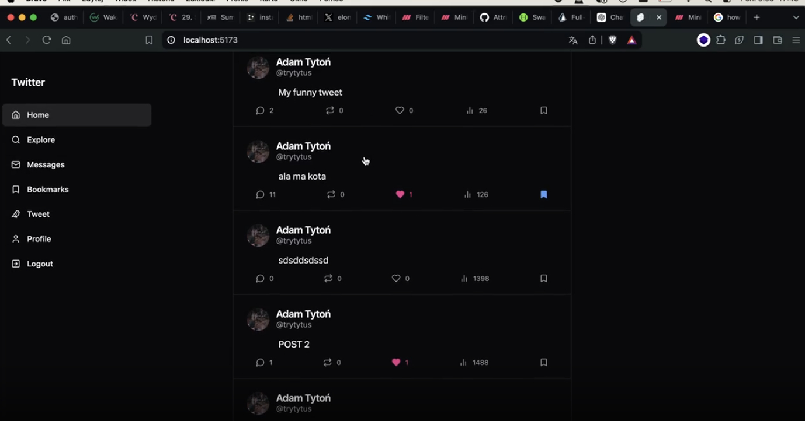

# My projects:

## Twitter clone

### Tech stack:

> *tailwindcss | nodejs | nestjs | postgresql | sveltekit | mongodb*

	<code></code>
	<code></code>
	<code></code>
	<code></code>
	<code></code>
	<code></code>

---
